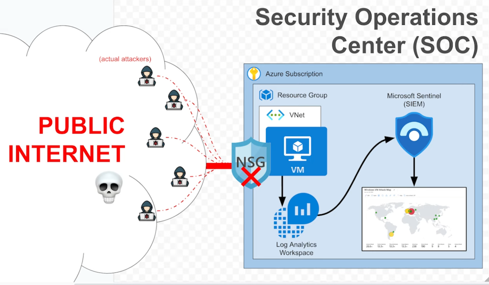

## Overview

I built a hands-on Azure honeypot to learn the SIEM workflow in a real cloud setting. By spinning up a purposely “wide-open” Windows VM inside its own VNet and resource group, I generate real attack traffic that’s streamed into a Log Analytics workspace. From there, Azure Sentinel ingests the logs, lets me write KQL queries to detect unusual behavior, and enriches events with geo-IP data so I can visualize attacker locations on an interactive world map. This end-to-end setup mirrors how security teams capture, analyze, and respond to threats in production environments.  

  

## Part 1: Resource Group & Virtual Network

Before standing up any resources, I created a dedicated container and network to keep my honeypot isolated:

1. **Resource Group**  
   I made `rg-honeypot-lab-eastus-001` in the **East US** region so all related resources live together and can be torn down easily when I’m done.
   
   

3. **Virtual Network**  
   Next I set up `vnet-honeypot-eastus-001` with a `/16` address space. This gives me plenty of room to add subnets later (for example, separate management or logging segments).
   
   
   
   

## Part 2: Deploying the Honeypot VM

I chose a Windows 10 Pro image and named the machine **vm-corpfinance-db-eastus-01** to make it look like a high-value “corporate database” server in the **East US** region. This deceptive name, combined with the default size makes it a tempting target for attackers.

## Part 3: Exposing All Inbound Traffic

To turn this VM into a true honeypot, I deliberately opened every port and protocol. In the VM’s Network Security Group (`vm-corpfinance-db-eastus-01-nsg`), I added a catch-all inbound rule named **DANGER_AllowAnyCustomAnyInbound** with:

- **Source:** Any  
- **Destination:** Any  
- **Port ranges:** * (all)  
- **Protocol:** Any  
- **Action:** Allow  
- **Priority:** 100  

This ensures any attacker can hit the VM, generating the noisy traffic I need for my SIEM pipeline.  

  

   
   

